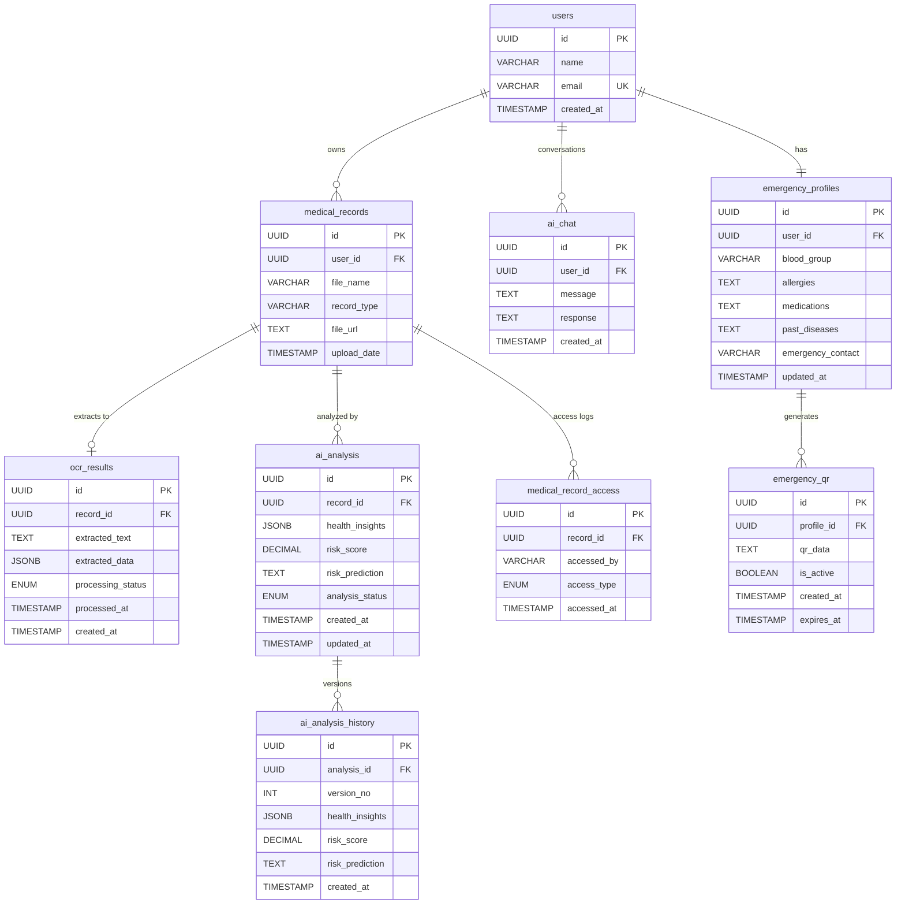

# 🗄️ MedVault — Database Architecture & Schema Design

This document details the database schema and table specifications for the **MedVault** Personal Health Record and Clinical AI Platform.

---

## 🏛️ Entity-Relationship Diagram (ERD)



---

## 📋 Table Specifications

### 1. `users`
The account record for each MedVault user. Authentication credentials are handled separately and are not stored in this table.

```sql
id UUID PK
name VARCHAR NOT NULL
email VARCHAR UNIQUE NOT NULL
created_at TIMESTAMP DEFAULT CURRENT_TIMESTAMP
```

---

### 2. `medical_records`
Uploaded medical documents and their associated metadata.

```sql
id UUID PK
user_id UUID FK → users(id) ON DELETE CASCADE
file_name VARCHAR NOT NULL
record_type VARCHAR
file_url TEXT NOT NULL
upload_date TIMESTAMP DEFAULT CURRENT_TIMESTAMP
```

---

### 3. `ocr_results`
Text and structured information extracted from uploaded medical records through OCR processing.

```sql
id UUID PK
record_id UUID FK → medical_records(id) ON DELETE CASCADE
extracted_text TEXT
extracted_data JSONB
processing_status ENUM('pending', 'processing', 'completed', 'failed')
processed_at TIMESTAMP
created_at TIMESTAMP DEFAULT CURRENT_TIMESTAMP
```

---

### 4. `ai_analysis`
AI-generated analysis, health insights, and potential risk predictions based on a user's medical records.

```sql
id UUID PK
record_id UUID FK → medical_records(id) ON DELETE CASCADE
health_insights JSONB
risk_score DECIMAL(5,2)
risk_prediction TEXT
analysis_status ENUM('pending', 'processing', 'completed', 'failed')
created_at TIMESTAMP DEFAULT CURRENT_TIMESTAMP
updated_at TIMESTAMP DEFAULT CURRENT_TIMESTAMP
```

---

### 5. `ai_chat`
Conversation history between the user and the MedVault AI health assistant.

```sql
id UUID PK
user_id UUID FK → users(id) ON DELETE CASCADE
message TEXT NOT NULL
response TEXT NOT NULL
created_at TIMESTAMP DEFAULT CURRENT_TIMESTAMP
```

---

### 6. `emergency_profiles`
Critical medical information made available for emergency situations.

```sql
id UUID PK
user_id UUID FK → users(id) ON DELETE CASCADE
blood_group VARCHAR(10)
allergies TEXT
medications TEXT
past_diseases TEXT
emergency_contact VARCHAR(50)
updated_at TIMESTAMP DEFAULT CURRENT_TIMESTAMP
```

---

### 7. `emergency_qr`
QR codes generated from an emergency profile for quick access to critical medical information.

```sql
id UUID PK
profile_id UUID FK → emergency_profiles(id) ON DELETE CASCADE
qr_data TEXT NOT NULL
is_active BOOLEAN DEFAULT TRUE
created_at TIMESTAMP DEFAULT CURRENT_TIMESTAMP
expires_at TIMESTAMP NULL
```

---

### 8. `medical_record_access`
Records authorized access to a user's medical information, particularly useful for controlled sharing or emergency access.

```sql
id UUID PK
record_id UUID FK → medical_records(id) ON DELETE CASCADE
accessed_by VARCHAR(100)
access_type ENUM('user', 'emergency', 'authorized')
accessed_at TIMESTAMP DEFAULT CURRENT_TIMESTAMP
```

---

### 9. `ai_analysis_history`
Previous AI analysis versions retained when a medical record is analyzed multiple times.

```sql
id UUID PK
analysis_id UUID FK → ai_analysis(id) ON DELETE CASCADE
version_no INT NOT NULL
health_insights JSONB
risk_score DECIMAL(5,2)
risk_prediction TEXT
created_at TIMESTAMP DEFAULT CURRENT_TIMESTAMP

UNIQUE (analysis_id, version_no)
```

---

## 🛠️ PostgreSQL DDL Migration Script

```sql
-- Create ENUM types
CREATE TYPE ocr_status AS ENUM ('pending', 'processing', 'completed', 'failed');
CREATE TYPE ai_status AS ENUM ('pending', 'processing', 'completed', 'failed');
CREATE TYPE record_access_type AS ENUM ('user', 'emergency', 'authorized');

-- 1. Users Table
CREATE TABLE users (
    id UUID PRIMARY KEY DEFAULT gen_random_uuid(),
    name VARCHAR(255) NOT NULL,
    email VARCHAR(255) UNIQUE NOT NULL,
    created_at TIMESTAMP WITH TIME ZONE DEFAULT CURRENT_TIMESTAMP
);

-- 2. Medical Records Table
CREATE TABLE medical_records (
    id UUID PRIMARY KEY DEFAULT gen_random_uuid(),
    user_id UUID NOT NULL REFERENCES users(id) ON DELETE CASCADE,
    file_name VARCHAR(255) NOT NULL,
    record_type VARCHAR(100),
    file_url TEXT NOT NULL,
    upload_date TIMESTAMP WITH TIME ZONE DEFAULT CURRENT_TIMESTAMP
);

-- 3. OCR Results Table
CREATE TABLE ocr_results (
    id UUID PRIMARY KEY DEFAULT gen_random_uuid(),
    record_id UUID NOT NULL REFERENCES medical_records(id) ON DELETE CASCADE,
    extracted_text TEXT,
    extracted_data JSONB,
    processing_status ocr_status DEFAULT 'pending',
    processed_at TIMESTAMP WITH TIME ZONE,
    created_at TIMESTAMP WITH TIME ZONE DEFAULT CURRENT_TIMESTAMP
);

-- 4. AI Analysis Table
CREATE TABLE ai_analysis (
    id UUID PRIMARY KEY DEFAULT gen_random_uuid(),
    record_id UUID NOT NULL REFERENCES medical_records(id) ON DELETE CASCADE,
    health_insights JSONB,
    risk_score DECIMAL(5,2),
    risk_prediction TEXT,
    analysis_status ai_status DEFAULT 'pending',
    created_at TIMESTAMP WITH TIME ZONE DEFAULT CURRENT_TIMESTAMP,
    updated_at TIMESTAMP WITH TIME ZONE DEFAULT CURRENT_TIMESTAMP
);

-- 5. AI Chat History Table
CREATE TABLE ai_chat (
    id UUID PRIMARY KEY DEFAULT gen_random_uuid(),
    user_id UUID NOT NULL REFERENCES users(id) ON DELETE CASCADE,
    message TEXT NOT NULL,
    response TEXT NOT NULL,
    created_at TIMESTAMP WITH TIME ZONE DEFAULT CURRENT_TIMESTAMP
);

-- 6. Emergency Profiles Table
CREATE TABLE emergency_profiles (
    id UUID PRIMARY KEY DEFAULT gen_random_uuid(),
    user_id UUID UNIQUE NOT NULL REFERENCES users(id) ON DELETE CASCADE,
    blood_group VARCHAR(10),
    allergies TEXT,
    medications TEXT,
    past_diseases TEXT,
    emergency_contact VARCHAR(50),
    updated_at TIMESTAMP WITH TIME ZONE DEFAULT CURRENT_TIMESTAMP
);

-- 7. Emergency QR Table
CREATE TABLE emergency_qr (
    id UUID PRIMARY KEY DEFAULT gen_random_uuid(),
    profile_id UUID NOT NULL REFERENCES emergency_profiles(id) ON DELETE CASCADE,
    qr_data TEXT NOT NULL,
    is_active BOOLEAN DEFAULT TRUE,
    created_at TIMESTAMP WITH TIME ZONE DEFAULT CURRENT_TIMESTAMP,
    expires_at TIMESTAMP WITH TIME ZONE
);

-- 8. Medical Record Access Logs Table
CREATE TABLE medical_record_access (
    id UUID PRIMARY KEY DEFAULT gen_random_uuid(),
    record_id UUID NOT NULL REFERENCES medical_records(id) ON DELETE CASCADE,
    accessed_by VARCHAR(100) NOT NULL,
    access_type record_access_type NOT NULL,
    accessed_at TIMESTAMP WITH TIME ZONE DEFAULT CURRENT_TIMESTAMP
);

-- 9. AI Analysis History Table (Versioned)
CREATE TABLE ai_analysis_history (
    id UUID PRIMARY KEY DEFAULT gen_random_uuid(),
    analysis_id UUID NOT NULL REFERENCES ai_analysis(id) ON DELETE CASCADE,
    version_no INT NOT NULL,
    health_insights JSONB,
    risk_score DECIMAL(5,2),
    risk_prediction TEXT,
    created_at TIMESTAMP WITH TIME ZONE DEFAULT CURRENT_TIMESTAMP,
    CONSTRAINT uq_analysis_version UNIQUE (analysis_id, version_no)
);

-- Indexes for performance
CREATE INDEX idx_medical_records_user_id ON medical_records(user_id);
CREATE INDEX idx_ocr_results_record_id ON ocr_results(record_id);
CREATE INDEX idx_ai_analysis_record_id ON ai_analysis(record_id);
CREATE INDEX idx_ai_chat_user_id ON ai_chat(user_id);
CREATE INDEX idx_emergency_profiles_user_id ON emergency_profiles(user_id);
CREATE INDEX idx_emergency_qr_profile_id ON emergency_qr(profile_id);
CREATE INDEX idx_record_access_record_id ON medical_record_access(record_id);
```
